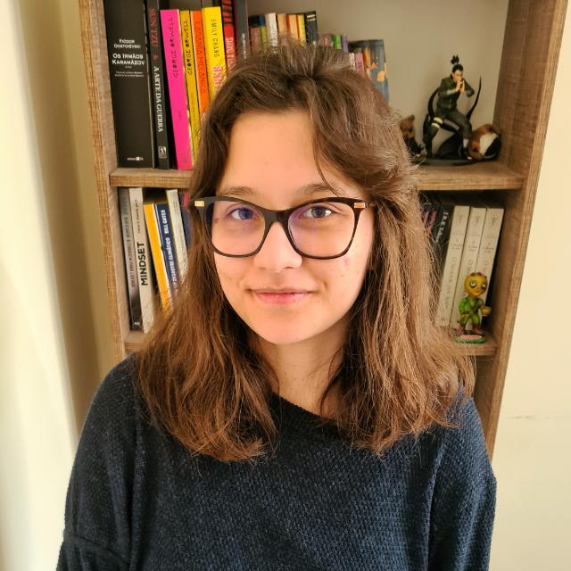

Stephany Beatriz Silva Nusch (she/her), born on May 20, 1995, in Santos, Brazil. I consider myself a creative person who wishes to live life with intention. 

**Gender equality and social causes focused on the inclusion of minorities are part of my life's purpose.**

I currently work at Microsoft as a Software Engineer specializing in front-end. I am obsessed with the Internet and how it works, so experimenting with new technologies is a lot of fun for me. I like to feel challenged and find personal satisfaction in learning new things. My ultimate professional goals are being an inspiration for women in tech and develop outstanding web experiences. Oh, and [this](https://github.com/stebsnusch) is my Github profile.

I also love to write - that's why I have this blog, and to listen to music. You can see who my favorite artists are on my [Last.fm](https://www.last.fm/user/chasedragons) profile - it can be chaotic.

As for social media, you can find me on [LinkedIn](https://www.linkedin.com/in/stephanynusch/), [YouTube](https://www.youtube.com/channel/UChWJKraH4Y-UtmhBST1gK2w) and [Twitter](https://twitter.com/stephdotjs) - it can also be chaotic. I don't really use Instagram or Facebook although I got profiles on both.

Got questions? Check out my [FAQ](/faq) page.