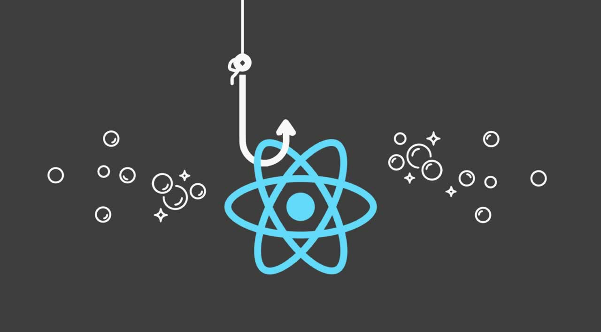

During the time I've been working as a Software Developer, I've seen people state often times that we tend to leave the fundamentals of the technology stack we use behind to ship code faster and deliver value to companies so the deadlines are met.

I have been there myself. We live in a time when things are fast-paced, changes happen all the time and we still need some time to live our personal lives. However, as you make your way into the industry, there is something that differs great developers from not-so-great ones: being able to explain why your code does what it does, and whether this is the best approach or not.

## What is Epic React

Epic React is a deep dive into how React works under the hood and basically everything you need to develop and test your applications like a pro. Led by Kent C. Dodds and built alongside a super talented team, the course is 9 chapters long and covers everything from the library's basics to its most advanced concepts.

Another interesting thing about it is that there is a special discount for those of you that, just like me, live in a region where the economy is not in its best shape. There are a few regional restrictions, but a) it's still worth it and b) you can upgrade your subscription anytime in the future.

During my journey through this course, I will be writing posts about my experience in every chapter. This way, not only I can revisit and exercise my retention of the content, but the post's audience can also consider purchasing the product and share their own experiences.

## The platform

As soon as you log in, you can access the course's Github repositories and start practicing — everything is SUPER hands-on. The first chapter is a brief overview of the application you're gonna be working on, and explanations on the configs, file structures, how to test, and so on.

This is one of the most mind-blowing parts for me: once you've configured the environment and started the app, you get into this built-in platform where you're able to navigate through exercises, see the real-time output of your code, manipulate HTTP request configs, and much more! I suggest you watch the video below to grasp a bit of what I'm saying:


&nbsp;

Personal tip: if you're running it on a Windows environment, I'd suggest you [install and configure the Windows Subsystem for Linux](https://www.the-digital-life.com/awesome-wsl-wsl2-terminal/) and run the code in your Ubuntu machine's terminal — it's been a fun experience for me so far. I grew used to Linux's terminal commands while working, so WSL saved my life here.

## React Fundamentals

Now that we're a bit more familiar with the platform, it's time to get our hands dirty. In the second chapter, we go over the very basics of React, and I found it crucial to start here, even having considerable experience with the library. I'll tell you why: I strongly believe that only by decoding the basics we're able to write meaningful, performant code. And faster.

We start by working with React's top-level API within a `<script>` tag and slowly make our way into importing it via ES6 modules. There are loads of exercises and challenges. You can also run the test files to make sure your code is properly written. The instructions are really straightforward and leave little to no room for misunderstandings. If you get stuck, there's a video walkthrough for each exercise, and you can try again as much as you want to.

## Personal favorites

In every post of this series, I'm gonna rank my favorite challenges. As for "React Fundamentals", those were:

1. Controlled and uncontrolled Form inputs
2. The "key" prop usage

I cannot forget to mention the incredibly helpful blog posts linked in the description of each lecture. As someone who loves learning how things happen under the hood, it was fantastic to access such great content.

---

## Next up:  React Hooks

I'm excited to start the next chapter on React Hooks because I love using them in my applications. React has become such a powerful tool it's no surprise its usage in the market grows every day. I have always enjoyed its flexibility and hooks stepped in to add even more to the game.
