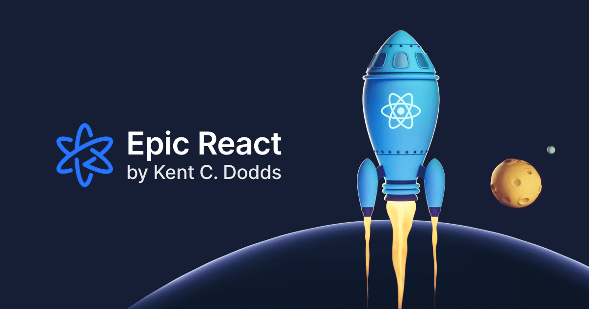
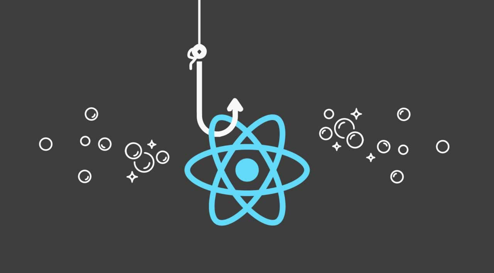

## O que é Epic React

Epic React é uma imersão em como o React funciona nos por baixo dos panos, e basicamente tudo que você precisa para desenvolver e testar seus aplicativos como um profissional. Liderado por Kent C. Dodds e construído ao lado de uma equipe super talentosa, o curso tem 9 capítulos e cobre tudo, desde o básico da biblioteca até seus conceitos mais avançados.

Outra coisa interessante é que há um desconto especial para vocês que, assim como eu, moram em uma região onde a economia não está na sua melhor forma. Existem algumas restrições regionais, mas a) ainda vale a pena e b) você pode atualizar sua assinatura a qualquer momento no futuro.

Durante minha jornada por este curso, vou escrever posts sobre minha experiência em cada capítulo. Dessa forma, não apenas posso revisitar e exercitar minha retenção do conteúdo, mas o público do post também pode considerar a compra do produto e compartilhar suas próprias experiências.

## A plataforma

Logo após logar, você pode acessar os repositórios Github do curso e começar a praticar - tudo é SUPER prático. O primeiro capítulo é uma breve visão geral do aplicativo no qual você trabalhará e explicações sobre as configurações, estruturas de arquivo, como testar e assim por diante.

Esta é uma das partes mais incríveis para mim: depois de configurar o ambiente e iniciar o aplicativo, você entra nesta plataforma integrada onde é capaz de navegar pelos exercícios, ver os resultados em tempo real, manipular configurações de solicitação HTTP e muito mais! Sugiro que você assista ao vídeo abaixo para entender um pouco do que estou dizendo:


&nbsp;

Dica pessoal: se você estiver utilizando um ambiente Windows, sugiro que você [instale e configure o subsistema do Windows para Linux](https://www.the-digital-life.com/awesome-wsl-wsl2-terminal/) e execute o código no terminal da sua máquina Ubuntu - tem sido uma experiência divertida para mim até agora. Eu me acostumei com os comandos de terminal do Linux enquanto trabalhava, então o WSL salvou minha vida aqui.

## React Fundamentals

Agora que estamos um pouco mais familiarizados com a plataforma, é hora de botar a mão na massa. No segundo capítulo, repassamos o básico do React. Achei crucial começar aqui, mesmo tendo uma experiência considerável com a biblioteca. Vou te dizer o porquê: eu acredito fortemente que, somente dominando o básico, somos capazes de escrever um código significativo e de alto desempenho. E mais rápido.

Começamos trabalhando com a API de alto nível do React dentro de uma tag `<script>`, e lentamente trilhamos nosso caminho para importá-la através de módulos ES6. Tem muitos exercícios e desafios. Você também pode executar os arquivos de teste para certificar-se de que seu código foi escrito corretamente. As instruções são realmente diretas e deixam pouco ou nenhum espaço para más interpretações. Se você ficar preso, há um passo a passo em vídeo para cada exercício e você pode tentar novamente o quanto quiser.

## Favoritos pessoais

Em cada postagem desta série, vou classificar meus desafios favoritos. Quanto aos "Fundamentos do React", eram:

1. Formulários controlados e não controlados
2. O uso de prop "key"

Não posso esquecer de mencionar as postagens de blog incrivelmente úteis vinculadas na descrição de cada capítulo. Como alguém que adora aprender como as coisas acontecem nos bastidores, foi fantástico acessar um conteúdo tão bom.

---

## A seguir: React Hooks

Estou empolgada para começar o próximo capítulo sobre React Hooks porque adoro usá-los em meus aplicativos. O React se tornou uma ferramenta tão poderosa que não é surpresa que seu uso no mercado cresça a cada dia. Sempre gostei de sua flexibilidade e hooks trazem ainda mais opções.
